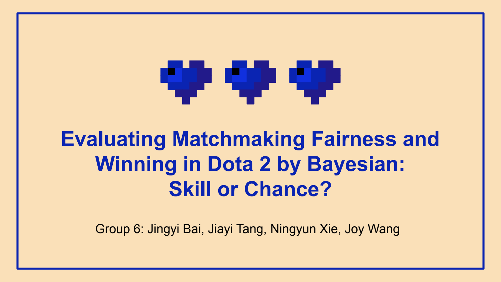

# Dota 2: Matchmaking & Winning Factors

**Bayesian analysis · R · Stan · Esports analytics**

How do observed player win rates vary across participation groups, and which player and team statistics are associated with winning? This DATASCI 451 group project combines a hierarchical beta-binomial model with player-level and team-level Bayesian logistic regression.

[](docs/project-presentation.pdf)

**[View the presentation](docs/project-presentation.pdf)** · [Methods & findings](docs/methodology.md) · [Run the analysis](docs/setup.md) · [Data requirements](data/README.md)

## Project at a glance

| Question | Approach | What the original presentation reported |
| --- | --- | --- |
| Do observed win rates differ by participation? | Hierarchical beta-binomial models for players with 3–10 versus >10 observed matches | Posterior population means of 0.382 and 0.401 |
| Which individual statistics are associated with winning? | Bayesian logistic regression on standardized performance metrics | Gold was the only individual coefficient whose reported 95% credible interval excluded zero |
| How do team differences relate to outcomes? | One row per match; Radiant–Dire performance differences | Larger reported associations for team differences than individual statistics |

**Result status:** these are historical findings from the supplied slides, not results reproduced by this repository. The original notebook contains data-processing and model-execution errors. The organized implementation corrects them; the raw CSVs were not supplied, so its estimates remain unverified. Observational win rates alone do not establish matchmaking unfairness or causation.

## What is included

- Modular preparation with validated keys, correctly decoded team membership, unique player counts, and explicit team pairing.
- Standalone Stan models, configurable prior comparisons, and a runner that saves estimates, trace plots, sampler diagnostics, and scaling metadata.
- The original presentation and unchanged R Markdown notebook for provenance.
- Synthetic regression checks for critical data transformations; no generated match data presented as research evidence.

```text
R/                  Data preparation and model-input functions
stan/               Beta-binomial and logistic models
scripts/            Setup, syntax checks, and analysis runner
tests/              Synthetic preprocessing checks
docs/               Presentation, methodology, and setup guide
archive/            Unchanged original course notebook
data/               Input schema (CSVs supplied separately)
results/            Local generated outputs (excluded from Git)
```

## Quick start

Requires R, `dplyr`, `rstan`, and a C++ toolchain for model fitting. Run commands from this repository's root.

```bash
Rscript scripts/install_dependencies.R
Rscript scripts/check_syntax.R
Rscript tests/test_prepare_data.R
# Add the three CSVs described in data/README.md, then:
Rscript scripts/run_analysis.R --prepare-only
Rscript scripts/run_analysis.R --model all --prior both
```

Syntax and synthetic data checks do not require the research dataset. Fitting does. See [setup](docs/setup.md) for options and [methodology](docs/methodology.md) for changes from the course analysis and interpretation limits.

## Credits

**Original project:** DATASCI 451, Winter 2025, Group 6 — Jingyi Bai, Jiayi Tang, Ningyun Xie, and Joy Wang. The supplied materials describe collaborative work and do not assign individual contributions.

The presentation credits Slidesgo, Flaticon, and Freepik for its template and visual assets. These credits are retained in the original PDF. Source materials and third-party assets retain their respective rights; this repository does not grant a blanket license over them.
